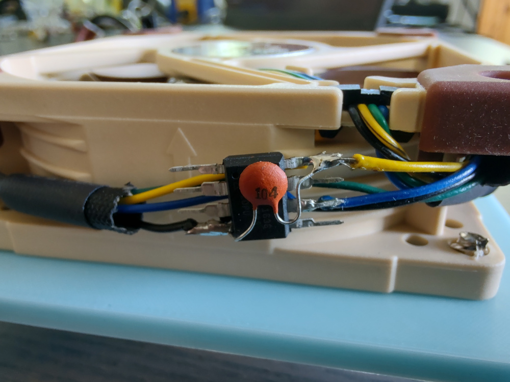

# Fixed-speed PWM fan control

Based on ATtiny85. All settings are hardcoded.



## How to build firmware

```shell
# Full speed:
make clean && make DUTY_CYCLE=0 hpwm.hex
# Half speed:
make clean && make DUTY_CYCLE=128 hpwm.hex
# 1/4 speed:
make clean && make DUTY_CYCLE=192 hpwm.hex
```

## Schematic

```text
                         ATtiny85
                    --------\/--------
       [RST] -------| 1 PB5    VCC 8 |------- +5V (yellow, 5V fans only)
                    |                |    |
                  --| 2 PB3    PB2 7 |----(-- [SCK]
                    |                |    |
                  --| 3 PB4    PB1 6 |----(-- [MISO]/PWM out (blue)
                    |                |    |
 GND (black) -------| 4 GND    PB0 5 |----(-- [MOSI]
               |    ------------------    |
               |                          |
               |____________||____________|
                            ||
                          0.1 μF

* [...] - for programming only.
* (...) - fan wire color.
```

## TODO

* Adjust speed dynamically based on measurements from ATtiny's internal
temperature sensor, see "17.12 Temperature Measurement" in the
[datasheet](https://ww1.microchip.com/downloads/en/DeviceDoc/Atmel-2586-AVR-8-bit-Microcontroller-ATtiny25-ATtiny45-ATtiny85_Datasheet.pdf).
